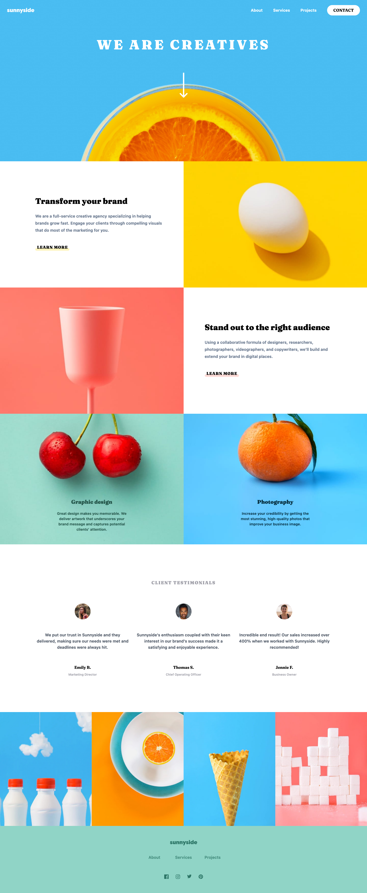
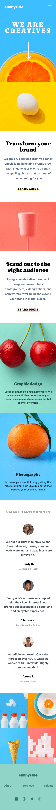

# Frontend Mentor - Sunnyside agency landing page solution

This is a solution to the [Sunnyside agency landing page challenge on Frontend Mentor](https://www.frontendmentor.io/challenges/sunnyside-agency-landing-page-7yVs3B6ef). Frontend Mentor challenges help you improve your coding skills by building realistic projects.

## Table of contents

-   [Overview](#overview)
    -   [The challenge](#the-challenge)
    -   [Screenshot](#screenshot)
    -   [Links](#links)
-   [My process](#my-process)
    -   [Built with](#built-with)
    -   [What I learned](#what-i-learned)
    -   [Continued development](#continued-development)
    -   [Useful resources](#useful-resources)
-   [Author](#author)
-   [Acknowledgments](#acknowledgments)

**Note: Delete this note and update the table of contents based on what sections you keep.**

## Overview

### The challenge

Users should be able to:

-   View the optimal layout for the site depending on their device's screen size
-   See hover states for all interactive elements on the page

### Screenshots

#### Desktop


#### Mobile


### Links

Solution URL: [Frontend Mentor - Solution URL](https://www.frontendmentor.io/solutions/react-nextjs-tailwind-desktopmobile-custom-hook-abHDwXNT4G)
Live Site URL: [Deployed Site URL](https://frontend-mentor-sunnyside-agency-kohl.vercel.app/)

## My process

### Built with

-   Semantic HTML5 markup
-   Flexbox
-   CSS Grid
-   [React](https://reactjs.org/) - JS library
-   [Next.js](https://nextjs.org/) - React framework
-   [Tailwind CSS](https://tailwindcss.com/) - For styling

### What I learned
#### Static landing-page structuring using semantic html

#### Experimented with React project folder structure. Went with `Layout` (for sections) and `Components` to separate concerns

```tsx
export default function Home() {
    return (
        <main className={`${fraunces.variable} ${barlow.variable} text-lg`}>
            <TopSection />
            <About />
            <Testimonials />
            <Projects />
            <Footer />
        </main>
    );
}
```

#### Learned about pros & cons of Flexbox and Grid. It was challenging to get the block-like sections to behave. Grid made it easy for both desktop and mobile responsive views

```tsx
import Image from "next/image";
import graphicDesign from "../images/desktop/image-graphic-design.jpg";
import photography from "../images/desktop/image-photography.jpg";
import standout from "../images/desktop/image-stand-out.jpg";
import transform from "../images/desktop/image-transform.jpg";
import graphicDesignMobile from "../images/figma/graphicDesignMobile.jpg";

export const About = () => {
    return (
        <section id="about">
            <div className="grid grid-cols-1 md:grid-cols-2">...</div>
        </section>
    );
};
```

#### Working with next/image component (as opposed to ``) was a challenge initially, but documentation and research helped a ton

```tsx
import Image from "next/image";
import { Header, Hero } from "../components";
import bg from "../images/figma/mae-mu-1-a-pt-yqz-naj-a-unsplash.png";
import mobileBg from "../images/mobile/image-header.jpg";

export const TopSection = () => {
    return (
        <div className="relative px-8 pb-12 pt-8">
            {/* for loading different image per screen size using next/image */}
            <picture>
                <source media={`(max-width: 567px)`} srcSet={mobileBg.src} />
                <Image
                    src={bg}
                    alt="background"
                    fill
                    style={{ objectFit: "cover", objectPosition: "center" }}
                />
            </picture>
            <Header />
            <Hero />
        </div>
    );
};
```

#### Figma VSCode extension to speed up working with assets and Dev Mode to see CSS styling at a glance

#### Imported SVGs as React Components and styled them using Tailwind utility classes such as `fill-white`

```tsx
 <div className="mt-16 flex gap-8 [&>*]:cursor-pointer [&>*]:hover:[&>*>*]:fill-white">
                    <span>
                        <FacebookIcon />
                    </span>
                    <span>
                        <InstagramIcon />
                    </span>
                    <span>
                        <TwitterIcon />
                    </span>
                    <span>
                        <PinterestIcon />
                    </span>
                </div>
            </div>
```

#### Implemented a custom hook `useClickOutside` to handle closing of mobileNav menu on click/touch outside of the menu element

```tsx
import { useCallback, useEffect, useRef, useState } from "react";

export default function useClickOutside<T extends HTMLElement>(initialIsVisible: boolean) {
    const [isComponentVisible, setIsComponentVisible] = useState(initialIsVisible);

    const ref = useRef<T | null>(null);

    const handleClickOutside = useCallback((event: MouseEvent) => {
        if (ref.current && !ref.current.contains(event.target as Node)) {
            setIsComponentVisible(false);
        }
    }, []);

    useEffect(() => {
        const handleClick = (event: MouseEvent) => {
            handleClickOutside(event);
        };

        document.addEventListener("click", handleClick, true);

        return () => {
            document.removeEventListener("click", handleClick, true);
        };
    }, [handleClickOutside]);

    return { ref, isComponentVisible, setIsComponentVisible };
}
```

### Continued development

This was a fun and challenging project. I was keen on using and solidifying techniques and tools that I've been utilizing at my job. I am very proud of the work I put in and excited about how the project turned out. 

I will continue advancing my NextJS/React expertise and get even better at fundamentals of HTML and CSS. Can't wait to get started on my next Frontend Mentor challenge!


### Useful resources

[Handling Hover, Focus, and Other States](https://tailwindcss.com/docs/hover-focus-and-other-states) - Tailwind documentation helped me figure out the best way to implement hover states for elements like SVGs.

[next/image](https://nextjs.org/docs/pages/api-reference/components/image) - NextJS documentation for the `next/image` component for optimizing images was crucial as it is a bit tricky at first. Luckily its widely used and there are plenty of usage examples around the web.


## Author

Personal Site - [Peter Lewandowski](https://peterlewandowski.dev/)
Frontend Mentor profile - [@peterlewandowski](https://www.frontendmentor.io/profile/peterlewandowski)
GitHub profile - [peterlewandowski](https://github.com/peterlewandowski)


## Acknowledgments

A huge thank you to my girlfriend who has been the most supportive in my journey in Software Engineering. Thank you to my mentors from Boca Code and at work!
